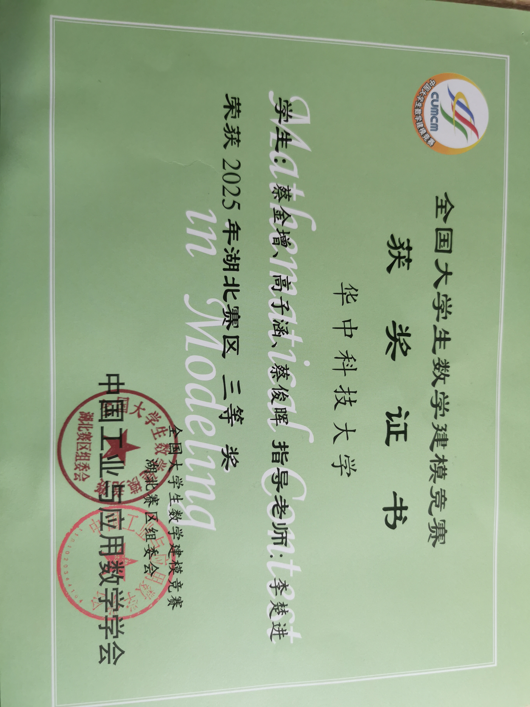

# 蔡金增 · 学术成果与项目作品集

**实习意向**：数据分析师  
**出生**：2006.5.25 | **电话**：15860937975 | **邮箱**：3955864169@qq.com

---

## 📚 教育背景
- **华中科技大学** 人工智能 | 本科（20xx.09 - 20xx.06）

---

## 📄 论文成果（EI录用 · 待刊）
- **论文题目**：基于LLM-Transformer的金融时序预测  
- **作者身份**：独立一作  
- **录用状态**：已被**第七届武汉国际计算机学术大会**录用，EI Compendex 待刊  
- **录用通知**：[点击查看/下载官方录用通知PDF](https://www.ais.cn/service/frontend/inform/226021112591187995?lang=cn)  
- **补充说明**：论文独立完成数据清洗、多模态数据集构建、模型设计与调优，通过消融实验与配对t检验验证有效性，并实现注意力热力图可解释性。

---

## 🏆 数学建模竞赛

### 全国大学生数学建模竞赛（省三等奖）
- **时间**：2025.10.1 - 2025.10.6  
- **角色**：代码负责人  
- **工作**：负责B题代码实现与算法优化，设计傅里叶分解频域滤波模块，基于薄膜干涉模型构建最小二乘拟合算法，通过迭代搜索策略降低拟合误差约20%。  
- **获奖证明**：  
    

### 美国大学生数学建模竞赛（待评奖）
- **时间**：2026.2.1 - 2026.2.4  
- **角色**：代码负责人  
- **工作**：针对《与星共舞》节目评分机制设计三种粉丝票数估计算法，构建排序与百分比融合模型，淘汰周预测准确率达92%以上；采用矩阵分解完成特征编码与权重分析，并开发可视化工具。  
- **当前状态**：**结果待评**（主办方尚未公布奖项）

---

## 🔬 在研项目

### 医疗多模态预测模型（在研）
- **时间**：2026.1.14 - 至今  
- **角色**：代码负责人  
- **工作内容**：  
  - 处理检验、病历、用药记录等多源异构数据，完成样本筛选、特征归一化与时间索引标准化  
  - 通过数据重塑生成以患者为组的宽表结构，设计缺失值与异常值过滤规则  
  - 评估多种检验方法对建模的影响，支撑后续疗效预测分析  
- **当前状态**：项目进行中，已完成高质量标准化数据集构建。

---

## 💻 技能与自我评价
- 熟练Python（建模、数据处理、可视化），C/C++良好  
- 善于从多角度优化算法，具备独立设计与调优能力  
- 自我驱动，沟通协作能力强，有文案策划能力  
- 熟练使用Excel、Word、PPT，了解SQL基础操作

---

> 📌 **说明**：本作品集内所有成果均真实可查。论文录用通知可通过上方链接验证；国赛奖状附图片；美赛与大创因尚未出结果或处于进行中，已如实标注状态。如需进一步材料（如代码片段、论文摘要、项目报告），欢迎联系。
